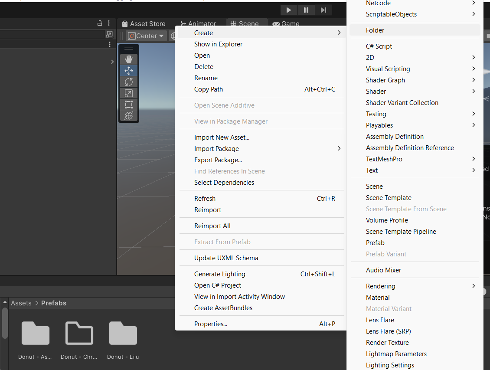
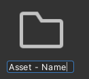

Step 1: Creating a prefab folder in unity 

- We use the naming scheme of

- Make sure that this is located in the prefabs folder of Unity in order to keep things orgnized

Step 2: Drag your .blend file into the folder
- See Asset Creation for how this blend file is made    
- Add a transparnt .PNG for scrap items to act as a icon for the hotbar 

Step 3: Setting up the Game Object
- Open some scene, preferably a blank scene in Unity
- Drag the .blend file into the scene
- remove anything that is not the actual object that you are planning on implementing

